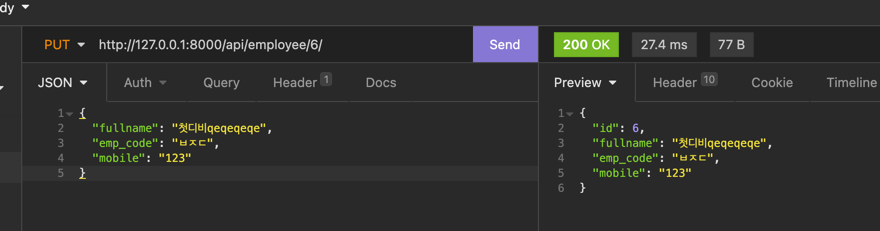

# Django_CRUD

#### 가상환경
- . venv/bin/activate

### create app
- django-admin startproject APPNAME
- python manage.py startapp employeeapi (플젝 파일? 생성)

### 순서
1. pip install django
2. pip install djangorestframework
3. pip install psycopg2 (Python에서 PostgreSQL을 다루기 위한 인터페이스 모듈이다.)
4. setting.py 파일 에서 INSTALLED_APPS에'employeeapi','rest_framework' 
5. setting.py 파일에서 DB연결 후 python manage.py migrate
6. model.py 파일에서 모델 생성 후 python manage.py makemigrations employeeapi

### 공부내용
- objects.all() 테이블 데이타를 전부 가져오기 위해서는
- objects.get()하나의 Row만을 가져오기 위해서는 get()
- objects.filter()특정 조건에 맞는 Row들을 가져오기 위해서는 filter() 메서드
- 